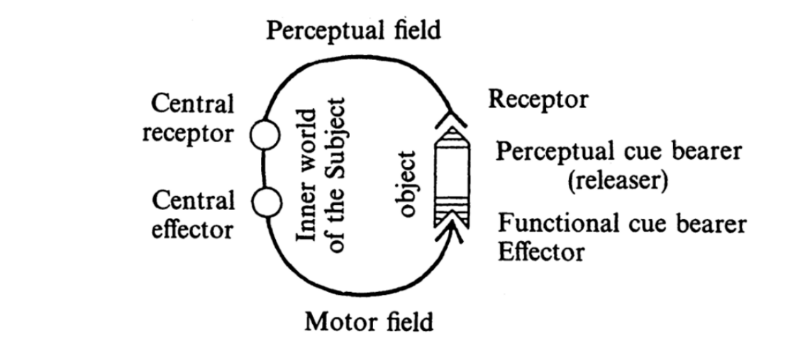
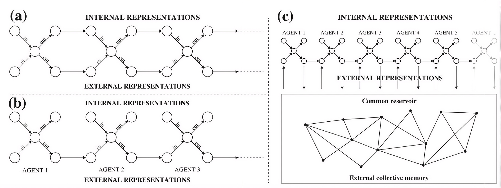

::::: {.thesis-container .text-left}

<!-- DOCUMENT TITLE -->

::: {.thesis-title}
# /02 What happens to urban landscaping?

:::

<!-- TEXT COLUMN (Paragraphs on Left) -->

:::: {.text-column}

The methods through which urbanism operated, inherited from its mother discipline architecture, became obsolete as the design medium upon which it based its concretization became increasingly maladjusted to the scale of the environment.

For architecture, this crisis, produced by the sheer immensity of the city, was characterized by an increasing "regime of complexity" [^chap2-1] that rendered insufficient pre-modern concrete design media (profiles, cuts, plans, perspectives, constructive terms). Designing at an experienceable scale handed the design process from a close relation with the artifacts, where the concretization of the urban could be surveyed and designed from perceptual cues that came directly from the experience of the urban environment, to one where design based itself on a tabular and cartographic disassembly corpus of the urban environment.

For this discipline, tightly related to the perception and experience of space, the new immensity of the urban tissue was viewed by some authors as catastrophic. In the 1970s, Lefebvre (1972) [^chap2-2] noted that at that point, an epistemology of what the city had become did not even exist. Famously and polemically noted by Rem Koolhaas in his essay on urbanism, the crisis was qualified as a "collective shame" and a "crater of our understanding of the modern city" [^chap2-1].

According to Koolhaas (1995) [^chap2-1], the inability to concretely represent the 'problem of bigness' within the urban environment remains a largely ignored subject of research. Nevertheless, the epistemological challenge posed by massive scale is an ancient one. The anekantavada, the famous Jainist parable of the blind men and the elephant, encapsulates this dilemma: as each man observes only a localized fraction of the animal, they interpret their isolated experience as an entirely different entity—one sees the trunk as a snake, another the leg as a pillar, and the tail as a lion; all fail to share a sense of the beast as a whole.

Within modern planning rationale, the fragmented perspectives of the parable find their equivalent in what De Roo (2016) [^chap2-3] defines as the relativist approach to planning. Relativism, in this context, refers to the subjective worlds of meaning that emerge as individuals develop, exchange, and incorporate mentally constructed values. In this rationale, the human experience of the city is mapped as a synergetic Inter-Representation Network, where the individual urban agents comprising that network share only external representations of the phenomena. The analysis of this network shows it is fundamentally constrained by the biological dimensions of the agents' sensory receptors and the finite capacity of their motor effectors to process, convey, and manipulate the immensity of their urban experiences.

Producing from this perspective, and even planning a technical object, devolves forcefully into abstraction. This rationale allows for an experience of the urban that can only be conceived through an abstract, collective reservoir of memories and not shared experience.

While a shared reservoir of memories is defined by its relation to an external representation of the urban tissue, a shared experience relies on an intuitive, sensory relation to the urban environment and its inhabitants. By relying purely on abstraction, urban design is completed by imagination into utopic projects—projects which, much like the monstrous elephant in the Indian parable, are fantastic projections of the designer.

Due to the loss of sensibility over the urban landscape, what emanates through our partial perspective is a sense of extension devoid of meaning, colloquially termed 'junkspace' by Koolhaas (2002) [^chap2-5].

The parable of the Indian elephant reveals that this immensity is perceived to be outside of our Umwelt, which von Uexküll (1934/1957) [^chap2-6] defines as the lived sensory environment of the citizen. However, the complexity of the problem lies not only in the effectors but also in the actuators of our behavior vis-à-vis urban beings. As concepts deprived of sensibility are void, the epistemological crisis of immensity can be typified as a failure in the cognitive capacity to synthesize the urban landscape.

From a design perspective, a crisis in the concretization of urban ideations translates directly into the designer's inability to relate to the urban landscape. Becoming an 'irresponse-able' individual [^chap2-4], the designer produces and plans things to which they cannot relate. Consequently, as the scale challenges representation, designers develop difficulties expressing geographic thoughts within their design medium, unleashing actions upon the urban landscape that cannot be fully appreciated by the very designers who effectuated them.

The loss of form described above carries severe implications for the modern epoch, with dire consequences for the creative endeavor at the geographic scale. Viewed from a classical philosophical perspective, the lack of synthesis over the landscape marks a deterrence in our capacity for the creation of urban beings—its poiesis. Without bounds to the underlying form or eidos [^chap2-7], two dysfunctional creative dispositions emerge:

On the one hand, creation devoid of form produces a fragmented objectification of the urban fabric that devolves into mindless relations to the built environment without any unifying civic idea, sprawling into modern vernacular architecture.

On the other hand, forms devoid of creation tend toward utopian master plans that retreat entirely from the concrete production of the living urban tissue, taking refuge in pure geometry and abstract technologies.

For Louis Kahn (1969), creating without the measurable—which he equates to light—relegates architecture to the unmeasurable realm of Silence, an entirely imaginary and unmanifested exercise. The measurable, structurally aligned with the techne in architecture, constitutes the active medium through which light is spent to bring material beings into existence. Without the technical capacity to cast light into matter, buildings remain ontologically incomplete, manifesting either as unrealized abstractions or as monstrous materializations.

The art of architecture, therefore, requires dominion over technique to actualize entities endowed with a final cause (telos). Stripped of this teleological imperative, the twentieth-century urban landscape provoked a profound disciplinary anxiety: the fear that art would retreat from the discipline entirely. As this retreat materialized—a phenomenon diagnosed by Koolhaas (1995) [^chap2-1]—pure technique assumed control. The concretization of matter proceeded driven solely by the blind momentum of its efficient causes, or retreated into empty, meaningless geometries (pure eidos) [^chap2-7]. This epistemological collapse necessitates a subsequent historical inquiry: what were the specific abstract technologies that usurped the production of the city during this architectural retreat?

::::

<!-- MEDIA COLUMN (Images on Right) -->

:::: {.media-column}

::: {.media-citation}
figure 1. Funcional cycle [^chap2-fig-1]

:::

::: {.media-citation}
figure 2. Blind men and the elephant, 1907 American illustration. [^chap2-fig-2]

:::

::: {.media-citation}
figure 3. Three Synergetic Inter-Representation Network sub models [^chap2-fig-3]

:::

::: {.media-citation}
figure 4. Primitive hut [^chap2-fig-4]

:::

::::

:::::

::: {.index-footer-row style="justify-content: center;"}

::: {.index-footer-right style="width: 100%; justify-content: center;"}
<ul>
  <li><a href="index.html">Index</a></li>
  <li><a href="chap_1.html">Chapter 1</a></li>
  <li><a href="chap_2.html">Chapter 2</a></li>
  <li><a href="chap_3.html">Chapter 3</a></li>
  <li><a href="chap_4.html">Chapter 4</a></li>
  <li><a href="chap_5.html">Chapter 5</a></li>
  <li><a href="chap_6.html">Chapter 6</a></li>
  
  <li><a href="references.html">References</a></li>
</ul>
:::
:::

<h3> Footnotes</h3>

[^chap2-1]: Koolhaas, R. (1995).
[^chap2-2]: Lefebvre, H. (1972).
[^chap2-3]: De Roo, G. (2016).
[^chap2-4]: Kousoulas, S., & Radman, A. (2026).
[^chap2-5]: Koolhaas, R. (2002).
[^chap2-6]: von Uexküll, J. (1957).
[^chap2-7]: Aristotle. (1984).
[^chap2-fig-1]: von Uexküll, J. (1957).
[^chap2-fig-2]: Blind men and the elephant [Illustration]. (1907).
[^chap2-fig-3]: Stolk, E., & Portugali, J. (2016).
[^chap2-fig-4]: Eisen, C. (1755).
