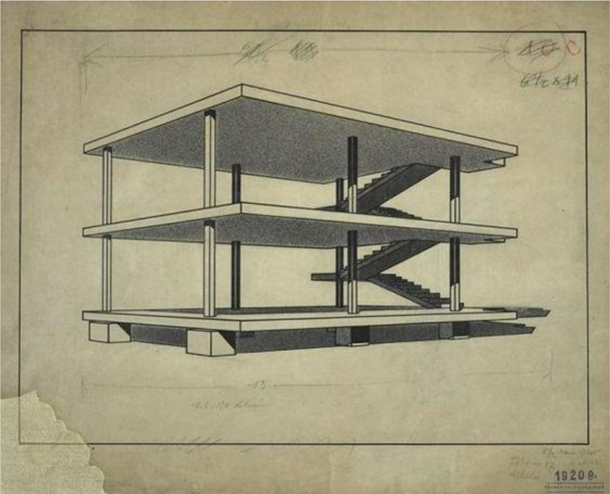
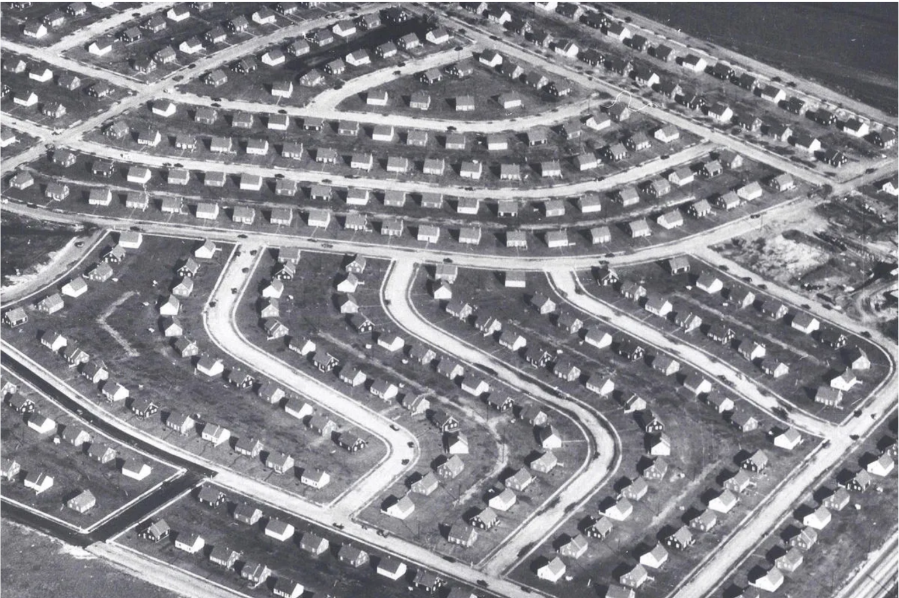
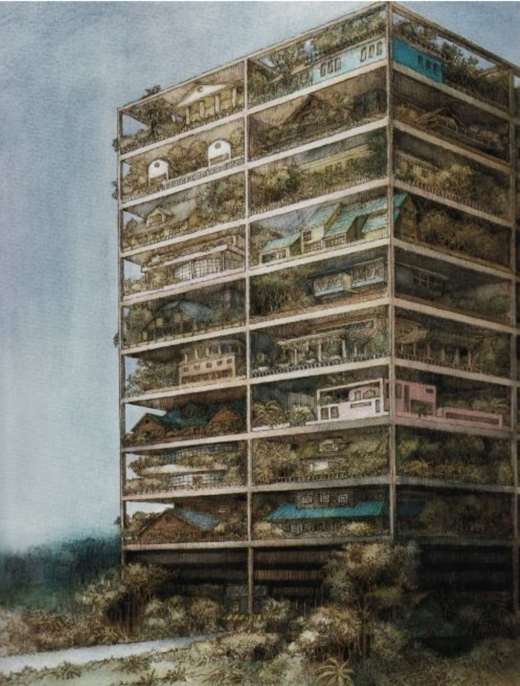

::::: {.thesis-container}

<!-- DOCUMENT TITLE -->

::: {.thesis-title}
# /03 The experimental disposition of the urban production

:::

<!-- MEDIA COLUMN (Images on Left) -->

:::: {.media-column}

::: {.media-citation}
figure 1: La maison Domino, Le Corbusier 1914-1915 [^chap3-fig-1]

:::

::: {.media-citation}
figure 2: Early Capes Aerial View of Levittown [^chap3-fig-2]

:::

::: {.media-citation}
figure 3: Highrise of houses, SITE 1981 [^chap3-fig-3]

:::

::::

<!-- TEXT COLUMN (Paragraphs on Right) -->

:::: {.text-column}

Design mediums that adapted to this new magnitude of the city relied heavily on science and technique, and would belong if we situated them in the cognitive capabilities of design elaborated by Roo (2016) [^chap3-1] in an objectivist pole. The project of scientifically approaching the city drove various disciplines to produce the urban environment through what Heidegger, M. (1977) [^chap3-2] would term an 'experimental disposition.

By producing urban elements in absolute isolation and subsequently injecting them into the urban environment from an abstract perspective, the scientific production, embodied in the management philosophy of Fordism and Taylorism, concretise the city by means of sterilization of its production from any relation that was not planned. 

The concretization of the urban tissue became then possible only through the decomposition of designed artifacts into discrete parts—parts that revealed increasingly precise, that could be manufactured into an isolated industrial chain. 

Another key element of the concretization of the modern urban landscape is the circumscription of domains of the urban into parcels. With this last link, the enterprise could, in anticipatory form, define the space that the urban beings were they would be concretised into the city.

The production of this urban landscape from a technological standpoint would engulf a strange paradox in the reading of Simondon (1958/2017) [^chap3-3]. As abstract objects are defined by their degree of freedom from the environment, the experimental device of the modern epoch would have somehow allowed abstraction to be placed over the environment. By means of isolation, it would have allowed the concretisation of a city of abstract parcels, each one with internal relations.

The elementarization of the city, achieved through this experimental disposition, was effectuated across several disciplinary domains. The most notable producers of the modern city—though by no means the only ones—were disciplines such as engineering and economics, which built vast, objective fields for measuring the design of the urban environment.

Nevertheless, this modern enterprise did not concern itself with the intuition that we could develop with the globality of the urban environment. Indeed, factors that would compromise the hermeticity of the chain of production, such as pre-existences or the complexity of the citizen, were destroyed or set aside in favor of a blank slate or canvas.

This established a strict realist perspective in city design: an approach that measures objective, quantifiable relations within the environment while failing to account for the human elements of its lived use (De Roo, 2016) [^chap3-1].

::::

:::::

::: {.index-footer-row style="justify-content: center;"}

::: {.index-footer-right style="width: 100%; justify-content: center;"}
<ul>
  <li><a href="index.html">Index</a></li>
  <li><a href="chap_1.html">Chapter 1</a></li>
  <li><a href="chap_2.html">Chapter 2</a></li>
  <li><a href="chap_3.html">Chapter 3</a></li>
  <li><a href="chap_4.html">Chapter 4</a></li>
  <li><a href="chap_5.html">Chapter 5</a></li>
  <li><a href="chap_6.html">Chapter 6</a></li>
  
  <li><a href="references.html">References</a></li>
</ul>
:::
:::

<h3> Footnotes</h3>

[^chap3-1]: De Roo, G. (2016).
[^chap3-2]: Heidegger, M. (1977).
[^chap3-3]: Simondon, G. (2017).
[^chap3-fig-1]: Le Corbusier. (1914).
[^chap3-fig-2]: Levittown library. (1950).
[^chap3-fig-3]: SITE (1981).
