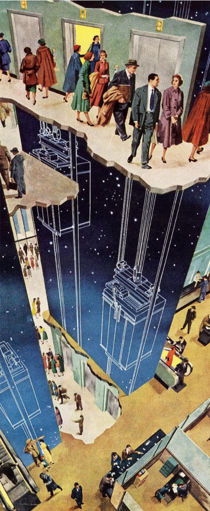

::::: {.thesis-container .text-left}

<!-- DOCUMENT TITLE -->

::: {.thesis-title}
# <span class="header-section-number">/04</span> Experiences of the modern urban landscape

:::

<!-- TEXT COLUMN (Paragraphs on Left) -->

:::: {.text-column}

It was Le Corbusier who, as early as Vers une architecture (1923), translated this objective rationale directly into architecture. By decomposing the conditions of inhabitation into components, he famously dreamt of mass-producing houses the way industry manufactured cars [^chap4-2]. He put forward the modernist vision of the 'machine for living', a technological project of building an habitational unit. synergized with the industrialization of construction, driving the development of concrete formwork, sheet metal, steel structural modules, and advanced insulation technologies. The genealogy uniting modern architecture with industrialization meant that construction techniques were fully adapted to this elementarization of the aspect of human life, a sort of life support as Sloterijk. (2016) [^chap4-1].

The legacy of Le Corbusier's habitational units —and their conceptual roots in the localized efficiency of the automobile —has fundamentally configured our experience of the modern urban fabric. Through capsular transit and the development of life-supported spatial enclosures, the locomotion barriers and sheer immensity imposed by the geographic scale can finally be managed. The proliferation of these technical spheres that envelop us constitutes one of the most defining characteristics of the contemporary urban environment. As François Ascher asserts, the order of the modern metropolis relies heavily on its capacities for storage, logistics, and isolation [^chap4-3]. Consequently, everyday technologies—such as refrigerators, air conditioners, electrical outlets, polarized windows, and free-flowing highways—act as crucial prosthetic devices to preserve the co-isolation that configures our urban life. These technologies actively configure the deterritorialized, insulated relationship we now maintain with the broader urban environment.

Within this encapsulating foam, geographic scale loses its immediate relevance. Much like the weather outside a well-built home is rendered inconsequential to its inhabitants, we have technologically disengaged our daily lives from the sheer immensity of the city. The ordinary experience of the urban tissue no longer requires a sustain itself in physical confrontation with its overall aspect. Moreover, design of the urban environment absolutely seem to demand it in order to orchestrate the geography of the urban landscape.

Many times under hodology, the foamy experience of the modern city organizes its logistics through a discontinuity between states of movement and inertia, where movement attempts, through the means of velocity, to overcome the logistic challenges of physical distances. As Koolhaas mentions, this discontinuity takes the maximum architectural form of what we could call, in terms of topological features, nodes of maximum degree of connection. From the logic of the hyperlink, through the suspensive space of the elevator, to the enormous hub-and-spoke terminals of airports, the modern city landscape reveals itself through the triumphant genealogy of machines to inhabit movement.

Through speed and life-support systems, modern technology has pushed the utopia that immensity could be inhabited through instantaneity. Many abstract technologies have been devised by science fiction to finally split the existence in motion from that of stillness. While science fiction has long devised abstract technologies to permanently bifurcate existence into absolute motion and absolute stillness—such as the teleporter of Star Trek or the hyperdrive of Star Wars—the project of inhabiting 'bigness' has driven contemporary geography and technical genealogies toward the exact same binary division of the world.

::::

<!-- MEDIA COLUMN (Images on Right) -->

:::: {.media-column}

::: {.video-container}
```{=html}
<video width="100%" autoplay loop muted playsinline controls>
  <source src="figures/chap_4_fig_1_Mickey-s-Trailer-1938.mp4" type="video/mp4">
</video>
```

:::

::: {.media-citation}
figure 1. Mickey's trailer [^chap4-fig-1]

:::

.png)

::: {.media-citation}
figure 2. Standard Station, Ed Ruscha (1966) [^chap4-fig-2]

:::



::: {.media-citation}
figure 3. The tenants think it’s wonderful, Otis 1952 [^chap4-fig-3]

:::

::::

:::::

<hr style="border:none; border-top: 1px solid #ddd; margin: 3rem 0;">

::: {.index-footer-row style="justify-content: center;"}

::: {.index-footer-right style="width: 100%; justify-content: center;"}
<ul>
  <li><a href="index.html">Index</a></li>
  <li><a href="chap_1.html">Chapter 1</a></li>
  <li><a href="chap_2.html">Chapter 2</a></li>
  <li><a href="chap_3.html">Chapter 3</a></li>
  <li><a href="chap_4.html">Chapter 4</a></li>
  <li><a href="chap_5.html">Chapter 5</a></li>
  <li><a href="chap_6.html">Chapter 6</a></li>
  
  <li><a href="references.html">References</a></li>
</ul>
:::
:::

<h3> Footnotes</h3>

[^chap4-1]: Sloterdijk, P. (2016).
[^chap4-2]: Le Corbusier. (1923).
[^chap4-3]: Fabian Alvarado David. (2016).
[^chap4-fig-1]: Sharpsteen, B. (1938).
[^chap4-fig-2]: Ed Ruscha (1966).
[^chap4-fig-3]: Otis Elevator Company. (1952).
