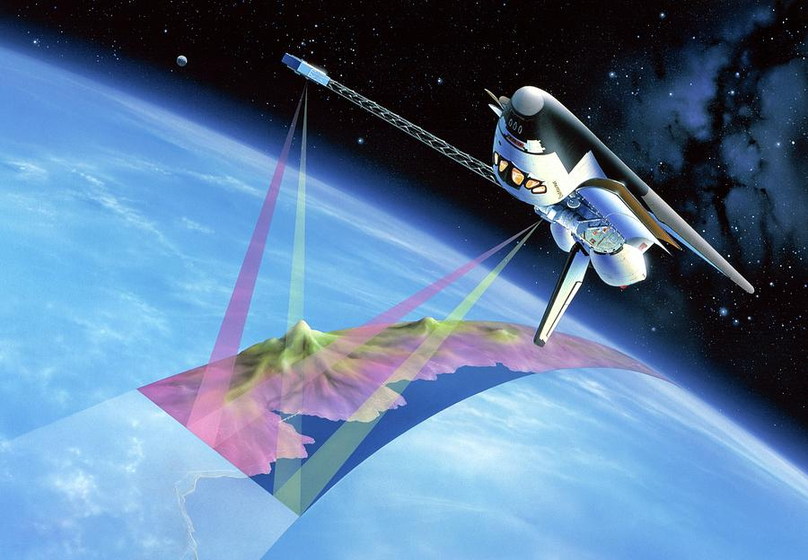
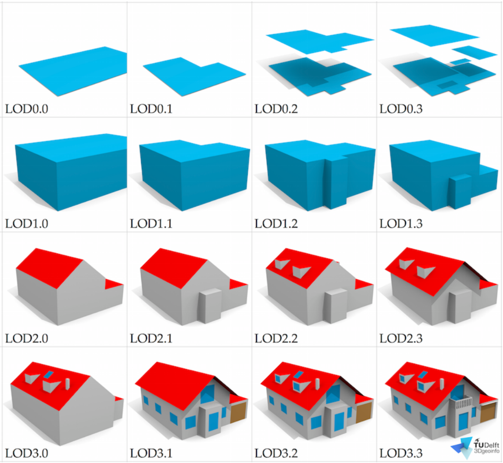
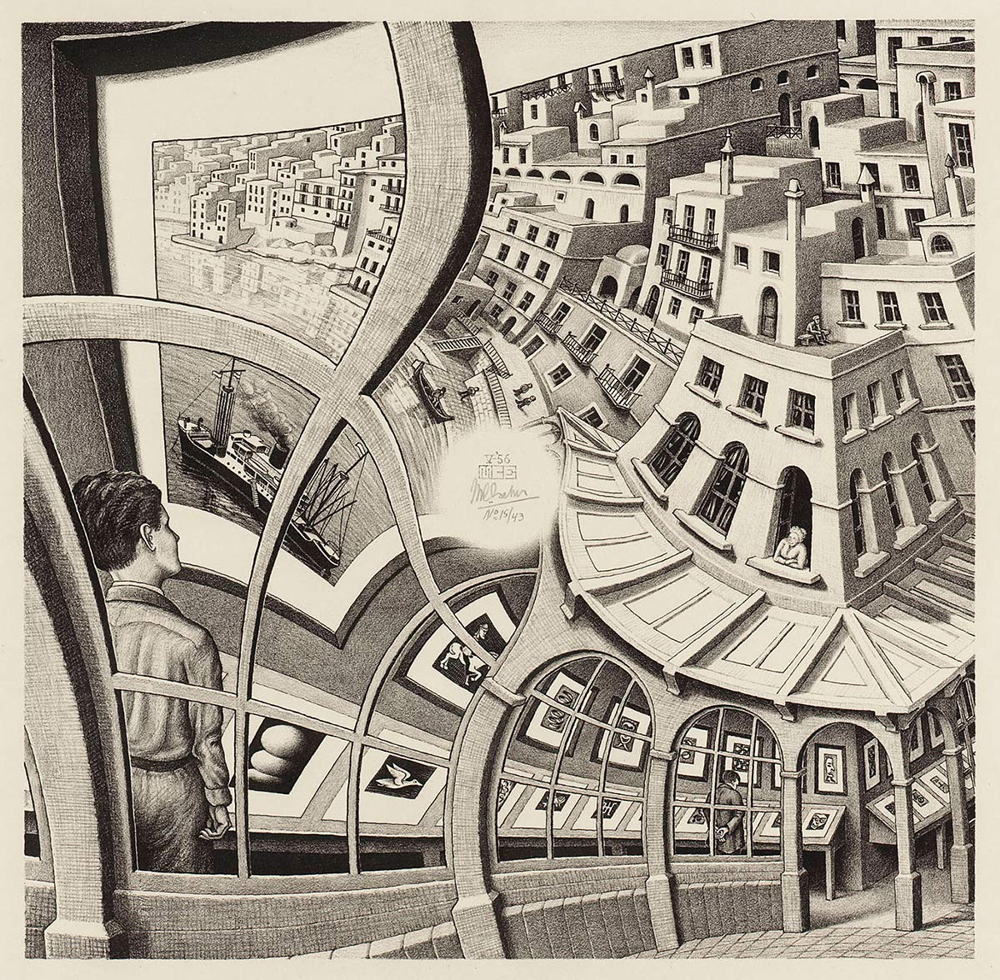

::::: {.thesis-container}

<!-- DOCUMENT TITLE -->

::: {.thesis-title}
# <span class="header-section-number">/05</span> The geodesic enterprise and the production of the image of the world

:::

<!-- MEDIA COLUMN (Images on Left) -->

:::: {.media-column}



::: {.media-citation}
figure 1: Shuttle Nasa Topography Mission (SRTM) (1999) [^chap5-fig-1]

:::

::: {.video-container}
```{=html}
<video width="100%" autoplay loop muted playsinline controls>
  <source src="figures/chap_5_fig_3_Google-Earth-Studio-Animation-Reel_.mp4" type="video/mp4">
</video>
```

:::

::: {.media-citation}
figure 2: Google Earth Studio. (2018) Animation Reel [^chap5-fig-2]

:::



::: {.media-citation}
figure 3: Improved LOD specification for 3D building models [^chap5-fig-3]

:::



::: {.media-citation}
figure 4: The City of the Captive Globe, New York, 1972 [^chap5-fig-4]

:::

::::

<!-- TEXT COLUMN (Paragraphs on Right) -->

:::: {.text-column}

Parallel to this scientification of the built environment, other disciplines were also severely favoured when facing the change in the scale of the city, thanks to scientific and technological developments. Geography had previously dealt for centuries with the scale of the planet through the geodesic enterprise. This endeavour relied increasingly on the XX century, on concrete representations taken from aerial perspectives. This process culminated during the second half of the century when satellite imaging allowed for the concrete representation of the Earth at multiple scales.

Geodesy, derived from the Greek term for 'division of the Earth,' is the project responsible for measuring and producing an exact image of the globe. A daughter of geography, cartography, and mathematics, geodesy leaves behind the ancient, lived toponymic approach to location. Instead, it constructs a system of localization based entirely on the coordinates of the Earth's geometric copy: the geoid. Producing this image of the world soon became a primary means of measuring our cities. The sensory capture of global streets by technological giants like Google pulled the aerial view of maps down to a closer representation of our grounded experience.

The extension of the domain of the experimental disposition of the geodesic enterprise, populated the global and local scales with remote sensors. This marked an important advance on the concretization of the image of the world, and a historical milestone of modern science. Though not directly producing the physical urban environment, the geoid introduced in the lives of modern citizens a continuous representation of the Earth across every scale, from the cosmos down to the street. For the first time in modern history, the citizen could visually access the vast extension of the metropolis through a highly accurate virtual surrogate.

Heidegger (1938) [^chap5-1] warned that the abstract representation of the world would loom with its immensity over our authentic sensible experience. Yet, with the execution of this technological project, the image of the world has ironically become an essential prosthetic technology for navigating the modern metropolis. While this virtual mapping has changed neither the biological bandwidth of our receptors nor the capacity of our effectors, its frictionless, instantaneous locomotion has bypassed a major geographic barrier to experience urban landscape. By effectively eliminating distances, this technology simulates a return to the environmental scale.

As the modern epoch progresses, we are confronted with an image of the world that represents the different aspects of the urban being in increasingly higher degrees of resolution. This technospheric project has not only limited itself to map the simple artifacts that compose the city, but also has creept -increasingly evident in social networks marketing- into the complex human aspects of the city. 

Under a relationist framework (De Roo, 2016) [^chap5-2], the relations that we establish through a map of our world, concretize an experience where humans are subjected to the cartographic representation of urban beings. Mediated by an interface we sense and we are sensed by the urban and its inhabitants. The concretization of this image means that citizens and designers relate primarily to the representation of the urban landscape, and then its physical environment, in turn, is reconfigured to align with its images.

The extension of the geodesic project's domain to the representation of the positions and relations of humans in space, pushes the enterprise further in the technological concretisation of the horizon of our experience. Although integrating human complexity into the geodesic project remains theoretically controversial—a tension stemming from the alienation inherent in disembodied habitation—the modern scientific enterprise continuously seeks to concretize the habitation of this image and develop a genealogy of its modification. While we march towards the development of a remote sense of the urban landscape, we surpass the spatial immensity of the city. Nonetheless, the lack of an increase in our cognitive capacity to process this immense data, combined with the absence of tools necessary to effectively act upon this image of the world, constitutes the remaining frontier to the human habitation of the modern megalopolis.

::::

:::::

<hr style="border:none; border-top: 1px solid #ddd; margin: 3rem 0;">

::: {.index-footer-row style="justify-content: center;"}

::: {.index-footer-right style="width: 100%; justify-content: center;"}
<ul>
  <li><a href="index.html">Index</a></li>
  <li><a href="chap_1.html">Chapter 1</a></li>
  <li><a href="chap_2.html">Chapter 2</a></li>
  <li><a href="chap_3.html">Chapter 3</a></li>
  <li><a href="chap_4.html">Chapter 4</a></li>
  <li><a href="chap_5.html">Chapter 5</a></li>
  <li><a href="chap_6.html">Chapter 6</a></li>
  
  <li><a href="references.html">References</a></li>
</ul>
:::
:::

<h3> Footnotes</h3>

[^chap5-1]: Heidegger, M. (1977).
[^chap5-2]: De Roo, G. (2016).
[^chap5-fig-1]: Shuttle Nasa Topography Mission (SRTM) (1999)
[^chap5-fig-2]: Google Earth. (2018).
[^chap5-fig-3]: Biljecki, F., Ledoux, H., & Stoter, J. (2016).
[^chap5-fig-4]: Rem Koolhaas & Madelon Vriesendorp (1972).
