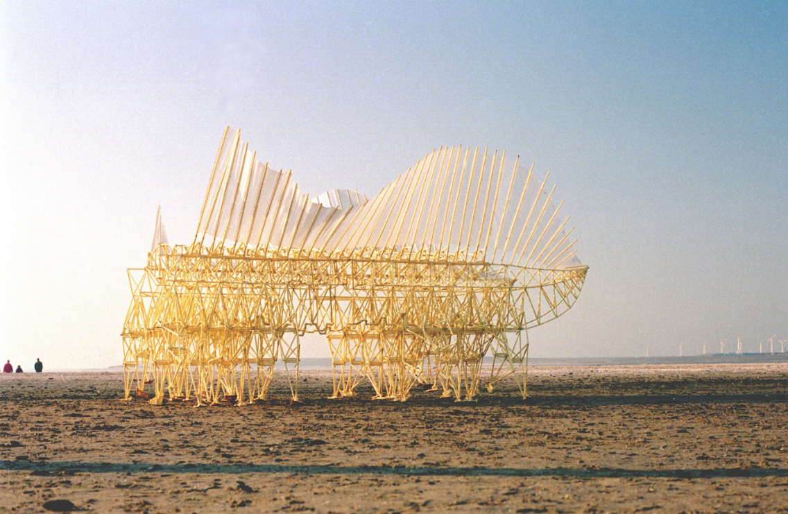
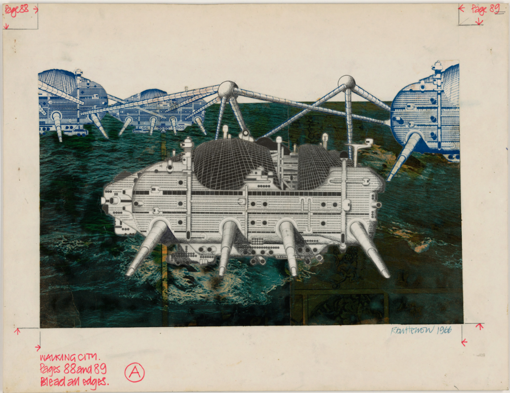

::::: {.thesis-container .text-left}

<!-- DOCUMENT TITLE -->

::: {.thesis-title}
# <span class="header-section-number">/06</span> A Genealogy of Machines to Inhabit the World

:::

<!-- TEXT COLUMN (Paragraphs on Left) -->

:::: {.text-column}

While remote sensing eliminates locomotion as a variable—compressing spatial immensity into an instant—it reveals another critical cognitive limitation issued from immensity. The primary barrier to navigating the modern urban landscape shifts to the information bandwidth of the human observer; as Portugali (2016) [^chap6-1] notes, the sheer proliferation of spatial data overwhelms the human capacity for internal representation.

To breach this other aspect of this ontological barrier, design methodologies increasingly rely on technologies that assist in the intake, compilation, and representation of environmental data. Robotic agents and algorithmic systems have emerged as necessary cognitive prosthetics, enabling simultaneous perception and action across a multiplicity of spaces. Within the contemporary urban experience, navigational agents, search engines, and AI chatbots already operate with agentic behavior. Consequently, the immense urban landscape is accessed not through direct intuition, but through the mediation of mechanical messengers.

The design and concretization through agents situate the user in a position where intent begins to be constituted and synthesized by the messengers. The announcement delivered by the user is subsequently processed by these messengers. Message delivery and the corresponding response operate entirely through this delegated sensing. Consequently, the concretization of design becomes the design of the messengers' experience; these agents navigate every facet of the model, undergoing the concrete experience within the design medium prior to its physical concretization. The production and reproduction of the image of the world constitutes an inhabited technological stratum. Because of the sheer scale and dimensionality of this reality, it remains inaccessible to the direct observation of the human designer. This virtual surrogate—commercially concretized by platforms such as Nvidia's 'Omniverse'—is inhabited not only by the digital representations of urban entities, but is actively navigated by the autonomous messengers that relate to them.

The design medium operates as a blank canvas where the user's intentions can be expressed in highly abstract forms, which are subsequently interpreted by the messengers. The drafting table now accommodates generalized traces; the scale and volume of information no longer constitute a barrier, as the preliminary interpretation is executed beforehand by the machine. This establishes a design medium characterized by a double hermeneutic: first, the autonomous agents interpret the human input and the digital material; second, the user must interpret the resulting algorithmic synthesis.

At first glance, one might assume this technological paradigm elevates the designer to an omnipotent position, transmitting teleological intent strictly through mechanical messengers. This dynamic mirrors a theological structure wherein an entity depends upon emissaries to manifest within a spatial dimension it cannot physically inhabit—in this instance, the sheer immensity of the geographic scale. However, critical analysis reveals a structural inversion: as these messengers develop and concretize within the urban environment, they cease to be mere conduits and become our habitats. As human interaction pours into these systems, the relational hierarchy inverts; the algorithmic infrastructure envelopes the citizen, emerging as a transcendental urban being that dictates the terms of modern habitation.

This inversion establishes a perichoresis—a mutual intertwining between human and machine to inhabit the world. Analyzed through Capurro’s (2003) [^chap6-2] angeletics, the mechanics of these messengers dictate that they do not merely transmit human intent; they actively configure the human subject's perception just as the human configures their algorithms.

This reciprocal configuration ultimately necessitates a transition toward an animistic view of the city. As autonomous agents continuously process, translate, and act upon the urban tissue, the inert infrastructure of the megalopolis is endowed with a cybernetic vitality. Drawing upon Emanuele Coccia’s (2021) [^chap6-3] theoretical framework, these algorithmic messengers function as contemporary "philosopher's stones"—alchemical mediums that animate the previously inanimate material of the metropolis. Through this angeletic infrastructure, the urban landscape ceases to be a static, geographic object and becomes an animistic ecology, defined by a continuous, communicative metabolism between human intent and autonomous matter.

::::

<!-- MEDIA COLUMN (Images on Right) -->

:::: {.media-column}

::: {.video-container}
```{=html}
<video width="100%" autoplay loop muted playsinline controls>
  <source src="figures/chap_6_fig_1_NVIDIA-Omniverse-Foundational-Technology.mp4" type="video/mp4">
</video>
```

:::

::: {.media-citation}
figure 1: NVIDIA Omniverse Foundational Technology Montage I GTC Spring 2025 Edition [^chap6-fig-1]

:::



::: {.media-citation}
figure 2: Currens Ventosa, Oostvoorne NL 1993, photo: Adriaan Kok [^chap6-fig-2]

:::



::: {.media-citation}
figure 3: Ron Herron Walking City on the Ocean, project (Exterior perspective) 1966 [^chap6-fig-3]

:::


::::

:::::

<hr style="border:none; border-top: 1px solid #ddd; margin: 3rem 0;">

::: {.index-footer-row style="justify-content: center;"}

::: {.index-footer-right style="width: 100%; justify-content: center;"}
<ul>
  <li><a href="index.html">Index</a></li>
  <li><a href="chap_1.html">Chapter 1</a></li>
  <li><a href="chap_2.html">Chapter 2</a></li>
  <li><a href="chap_3.html">Chapter 3</a></li>
  <li><a href="chap_4.html">Chapter 4</a></li>
  <li><a href="chap_5.html">Chapter 5</a></li>
  <li><a href="chap_6.html">Chapter 6</a></li>
  
  <li><a href="references.html">References</a></li>
</ul>
:::
:::

<h3> Footnotes</h3>

[^chap6-1]: Portugali, J. (2016).
[^chap6-2]: Capurro, R. (2003).
[^chap6-3]: Coccia, E. (2021).
[^chap6-fig-1]: NVIDIA. (2025).
[^chap6-fig-2]: Currens Ventosa, Oostvoorne.
[^chap6-fig-3]: Ron Herron (1966).
